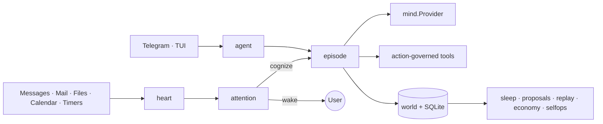

# Daimon

**A durable agent with a replaceable mind.** Daimon is a local-first, single-user runtime for sovereign personal agents, written in Go.

The agent's identity, values, skills, trust, world model, and audit history live on local disk. The LLM is a replaceable cognitive provider rather than the source of identity, so models can be changed and evaluated without discarding continuity.

> Module: `github.com/Forest-Isle/daimon` · Go 1.25.11 · Binary: `cmd/daimon`

[中文说明](README_zh.md)

## What it does

- **Event-driven autonomy** — messages, timers, files, mail, and calendar events enter a persistent heart and attention router.
- **Accountable cognition** — each bounded episode ends with a structured outcome recorded in the world journal.
- **Governed actions** — value checks, trust levels, reversibility classes, hold windows, undo, verification, and audit surround tool side effects.
- **Durable local state** — SQLite plus `~/.daimon` store identity, commitments, memory, skills, receipts, and runtime history.
- **Offline improvement** — sleep jobs consolidate state, distill repeated workflows, generate proposals, and maintain the runtime.
- **Model regression gates** — replay and deterministic canary suites compare provider changes before promotion.

## Architecture



`internal/gateway` is the composition root. Interactive channels and autonomous events converge on the episode kernel and share the same tool-governance chain. See the [as-built architecture](docs/architecture/README.md) for package boundaries and end-to-end flows.

## Quick start

Requirements: Go 1.25.11, CGO, and a C compiler for SQLite FTS5.

```bash
cp configs/daimon.example.yaml configs/daimon.yaml
# Configure an LLM provider/API key in configs/daimon.yaml or via environment variables.

make build
./bin/daimon version
./bin/daimon tui -c configs/daimon.yaml
# Or run the persistent runtime:
./bin/daimon start -c configs/daimon.yaml
```

Core verification:

```bash
make build-bin
make vet
make test-short
make test        # full CGO + fts5 + race suite
```

## CLI

The binary provides `start`, `tui`, `skill`, `memory`, `mcp`, `replay`, `canary`, `proposals`, `costs`, `correct`, `undo`, `holds`, `world`, `attention`, `trust`, and `soul` commands.

```bash
daimon canary run --config candidate.yaml   # deterministic provider gate
daimon trust list                           # inspect autonomy levels
daimon holds list                           # inspect delayed actions
daimon undo list                            # inspect reversible receipts
daimon world history identity.md            # inspect self-edit history
daimon soul export                          # export portable identity state
```

Run `daimon <command> --help` for exact flags. The full command map is in the [CLI reference](docs/architecture/21-cli-reference.md).

## Configuration and state

The canonical configuration map is [configs/daimon.example.yaml](configs/daimon.example.yaml). Configuration is resolved from built-in defaults, an explicit `-c` file or auto-discovered file, environment-variable expansion, and persistent feature overrides.

User-owned state lives under `~/.daimon`, including identity and values documents, attention rules, skills, agent definitions, MCP configuration, feature state, and the SQLite database. Secrets should be injected through `${VAR}` references rather than committed to YAML. See the [data-layer guide](docs/architecture/19-data-layer.md) and [security model](SECURITY.md).

## Documentation

- [Architecture index](docs/architecture/README.md) — authoritative as-built documentation.
- [Architecture guide](docs/ARCHITECTURE_GUIDE.md) — guided onboarding and data-flow walkthrough.
- [Daimon blueprint](DAIMON_BLUEPRINT.md) — design intent and target-state invariants; the as-built docs take precedence for current behavior.
- [Contributing](CONTRIBUTING.md) — worktree workflow and verification matrix.
- [Soak runbook](docs/SOAK_RUNBOOK.md) — long-running operational validation.

## License

See [LICENSE](LICENSE).
