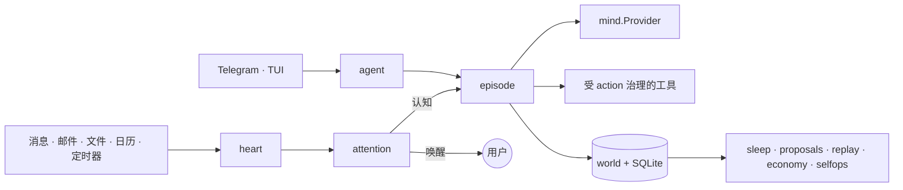

# Daimon

**铁打的代理，流水的脑。** Daimon 是一个用 Go 编写的本地优先、单用户主权个人 Agent 运行时。

Agent 的身份、价值观、技能、信任、世界模型和审计历史都保存在本地磁盘；LLM 只是可替换的认知 Provider，而不是身份本身。因此更换模型、做回归评测时，不需要丢弃 Agent 的连续性。

> **Alpha（`0.1.0`）**：面向单用户、本地优先场景。自治 Heart、Sleep 和 SelfOps 路径默认关闭；运行中断后，目前还不能从 Episode 的精确中间位置持久化续跑。

> 模块：`github.com/Forest-Isle/daimon` · Go 1.25.11 · 主二进制：`cmd/daimon`

[English](README.md)

## 功能特性

- **事件驱动自治** — 消息、定时器、文件、邮件和日历事件进入持久化 heart，再由 attention 路由。
- **认知必须交账** — 每个有界 episode 都以结构化 Outcome 收尾，并写入 world journal。
- **行动受控** — 工具副作用统一经过价值检查、信任等级、可逆性分类、hold 窗口、undo、验证和审计。
- **本地持久状态** — SQLite 与 `~/.daimon` 保存身份、承诺、记忆、技能、行动回执和运行历史。
- **离线持续改进** — sleep 作业整固状态、蒸馏重复工作流、生成提案并维护运行时。
- **模型回归门控** — replay 与确定性 canary 套件在模型晋升前比较行为变化。

## 架构



`internal/gateway` 是组合根。交互渠道与自治事件最终汇入 episode 内核，共用同一条工具治理链。包边界和端到端数据流见 [as-built 架构文档](docs/architecture/README.md)。

## 快速开始

环境要求：Go 1.25.11、CGO，以及用于 SQLite FTS5 的 C 编译器。

### 从源码构建

```bash
cp configs/daimon.example.yaml configs/daimon.yaml
# 在 configs/daimon.yaml 中配置 LLM Provider/API key，或通过环境变量注入。

make build
./bin/daimon version
./bin/daimon tui -c configs/daimon.yaml
# 或启动常驻运行时：
./bin/daimon start -c configs/daimon.yaml
```

### Docker

Docker Compose 需要本地配置文件，并通过 `daimon-data` volume 将用户状态持久化到 `/home/daimon/.daimon`：

```bash
cp configs/daimon.example.yaml configs/daimon.yaml
# 在 configs/daimon.yaml 中设置 telegram.allowed_user_ids，然后导出其中引用的密钥。
export ANTHROPIC_API_KEY="..."
export TELEGRAM_BOT_TOKEN="..."
docker compose up --build
```

容器以非 root 的 `daimon` 用户运行。除非将 `server.enabled` 设为 `true`，否则管理端仍保持关闭；若要在 Docker 中启用，还需把 `DAIMON_ADMIN_TOKEN` 传入容器，并根据预期的 Docker 网络策略选择可访问的监听地址。

### Release 压缩包

GitHub Releases 为 Linux 和 macOS 的 amd64、arm64 发布原生 CGO 压缩包：

```text
daimon_linux_amd64.tar.gz
daimon_linux_arm64.tar.gz
daimon_darwin_amd64.tar.gz
daimon_darwin_arm64.tar.gz
```

每个压缩包都包含 `daimon`、`LICENSE` 和 `README.md`，并同时发布 `checksums.txt`。

安装发布压缩包（按机器设置 `OS` 和 `ARCH`）：

```bash
VERSION=v0.1.0 OS=darwin ARCH=arm64
archive="daimon_${OS}_${ARCH}.tar.gz"
base="https://github.com/Forest-Isle/daimon/releases/download/${VERSION}"
curl -LO "$base/$archive"
curl -LO "$base/checksums.txt"
grep " $archive$" checksums.txt | shasum -a 256 -c -
tar -xzf "$archive"
./daimon version
```

核心验证命令：

```bash
make build-bin
make vet
make test-short
make test        # 完整 CGO + fts5 + race 测试
```

## CLI

主程序提供 `start`、`tui`、`skill`、`memory`、`mcp`、`replay`、`canary`、`proposals`、`costs`、`correct`、`undo`、`holds`、`world`、`attention`、`trust` 和 `soul` 命令。

```bash
daimon canary run --config candidate.yaml   # 确定性模型门控
daimon trust list                           # 查看自治信任等级
daimon holds list                           # 查看延迟执行的行动
daimon undo list                            # 查看可撤销行动回执
daimon world history identity.md            # 查看自我修改历史
daimon soul export                          # 导出可迁移的身份状态
```

精确参数以 `daimon <command> --help` 为准，完整命令地图见 [CLI 参考](docs/architecture/21-cli-reference.md)。

## 配置与状态

[configs/daimon.example.yaml](configs/daimon.example.yaml) 是权威配置地图。配置依次来自内置默认值、显式 `-c` 文件或自动发现文件、环境变量展开，以及持久化 feature 覆盖。

用户状态位于 `~/.daimon`，包括身份与价值文档、attention 规则、技能、Agent 定义、MCP 配置、feature 状态和 SQLite 数据库。密钥应通过 `${VAR}` 引用注入，不应直接提交到 YAML。详见 [数据层说明](docs/architecture/19-data-layer.md)与[安全模型](SECURITY.md)。

可选的管理 HTTP 端仅由 YAML `server` 配置控制，不属于运行时 Feature Registry。它默认关闭，默认监听 `127.0.0.1:8080`。启用时必须设置 `server.token: "${DAIMON_ADMIN_TOKEN}"`，且该环境变量必须解析为非空值；不要把 token 提交到版本库，访问 `/api/*` 路由时需发送 `Authorization: Bearer <token>`。`GET /health` 有意保持免认证；当前私有路由只有只读的 `GET /api/sessions`。

## 项目文档

- [架构索引](docs/architecture/README.md) — 当前实现的权威 as-built 文档。
- [架构导读](docs/ARCHITECTURE_GUIDE.md) — 面向新维护者的数据流和代码导览。
- [Daimon 蓝图](DAIMON_BLUEPRINT.md) — 设计意图与目标态不变量；当前行为以 as-built 文档为准。
- [贡献指南](CONTRIBUTING_zh.md) — worktree 流程和验证矩阵。
- [Soak Runbook](docs/SOAK_RUNBOOK.md) — 长时间运行验证手册。

## License

见 [LICENSE](LICENSE)。
